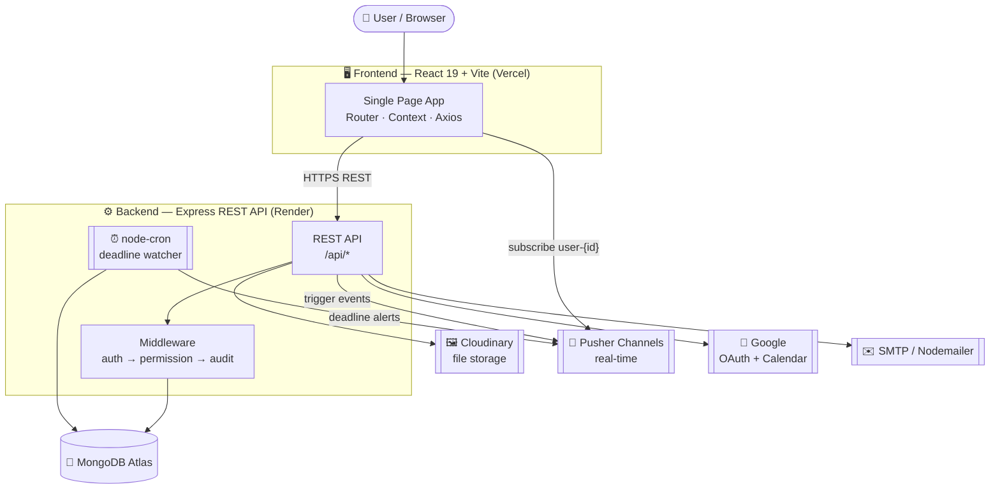
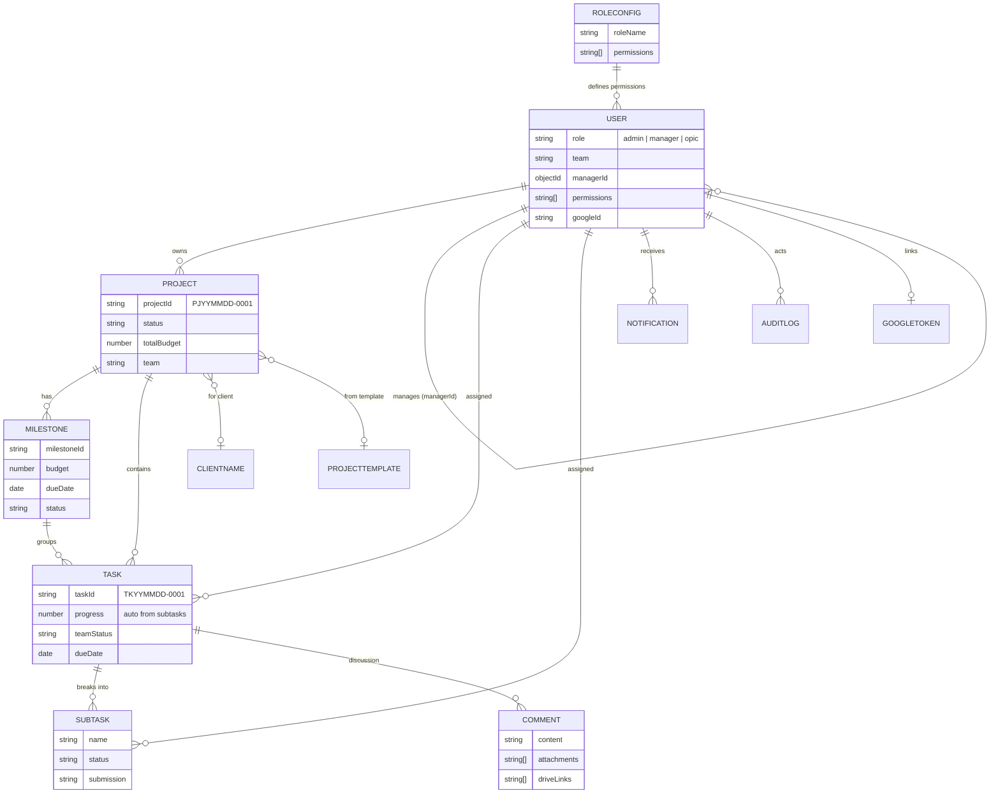
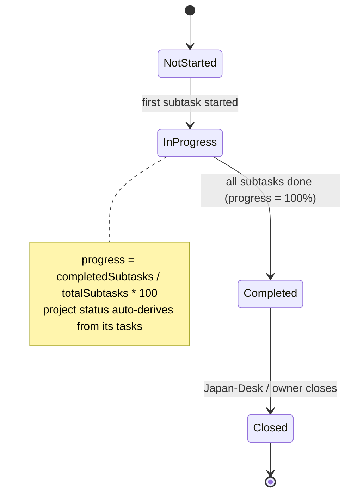
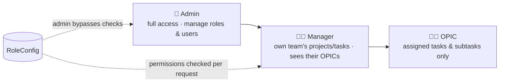
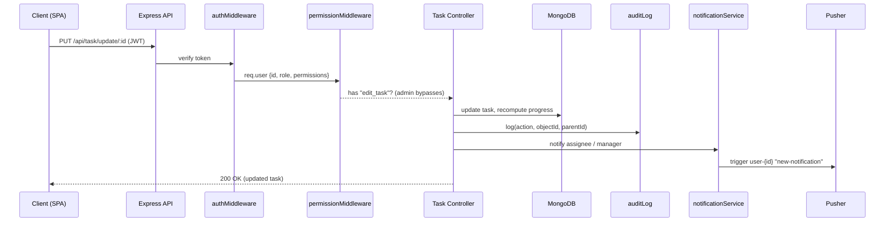

<div align="center">

# 🗂️ ProjectManager

### A production-grade, full-stack **MERN** project & task management platform

Role-based teams • Projects → Milestones → Tasks → Subtasks • Audit trails • Real-time
notifications • Google Calendar sync • Interactive dependency graphs & analytics


</div>

---

## 📑 Table of Contents
1. [Overview](#-overview)
2. [Key Features](#-key-features)
3. [Tech Stack](#-tech-stack)
4. [High-Level Design (HLD)](#-high-level-design-hld)
5. [Low-Level Design (LLD)](#-low-level-design-lld)
6. [Request Lifecycle & RBAC](#-request-lifecycle--rbac)
7. [Repository Structure](#-repository-structure)
8. [Local Setup](#-local-setup)
9. [Environment Variables](#-environment-variables)
10. [API Surface](#-api-surface)
11. [Roadmap](#-roadmap)
12. [License & Attribution](#-license--attribution)

---

## 🔭 Overview

**ProjectManager** is a multi-team project management tool inspired by enterprise PM suites.
It models the full hierarchy that real consulting/operations teams use —
**Projects → Milestones → Tasks → Subtasks → Comments** — on top of a configurable,
three-tier **role-based access control** system (Admin → Manager → OPIC) where an admin can
edit each role's permissions at runtime.

Every mutation is **audit-logged**, deadlines are watched by a **cron scheduler** that fires
**real-time push notifications**, files attach to **cloud storage**, and the dashboard renders
**workload/performance analytics** plus an interactive **D3 task-dependency graph**.

---

## ✨ Key Features

| Domain | What it does |
|---|---|
| 🔐 **Auth & RBAC** | JWT auth, Google OAuth login, 3-tier roles, **runtime-configurable permissions** per role |
| 📁 **Projects** | Auto-generated IDs (`PJYYMMDD-0001`), templates, budgets, team assignment, copy-project |
| 🎯 **Milestones** | Per-project phases with budget + due dates, auto-complete on task completion |
| ✅ **Tasks & Subtasks** | Status flow (Not Started → In Progress → Completed → Closed), **progress auto-rollup** from subtasks |
| 💬 **Comments** | Threaded comments with **file attachments** (cloud storage) + Google Drive links |
| 📊 **Analytics** | Recharts dashboards — workload forecast, target-vs-achieved, performance by week/month/year |
| 🕸️ **Dependency graph** | Interactive **D3.js** task hierarchy / dependency visualization |
| 📅 **Calendar** | FullCalendar + **two-way Google Calendar sync** |
| 🔔 **Notifications** | In-app + **Pusher real-time** + a `node-cron` deadline watcher |
| 🧾 **Audit logs** | Every create/update/delete recorded, with hierarchical visibility |
| 🗃️ **Templates & Clients** | Reusable project templates + client directory |

---

## 🧰 Tech Stack

**Frontend:** React 19, Vite, React Router 7, Axios, Recharts, D3.js, FullCalendar,
react-big-calendar, pusher-js, react-hot-toast, lucide-react / react-icons — custom CSS.

**Backend:** Node.js, Express, Mongoose (MongoDB), JWT + bcryptjs, Passport (Google OAuth),
googleapis, Multer + Cloudinary, Nodemailer, Pusher, node-cron, Winston.

**Infra (target):** MongoDB Atlas · Cloudinary · Pusher Channels · Frontend on Vercel · Backend on Render.

---

## 🏛️ High-Level Design (HLD)



**Flow in words:** the React SPA calls the Express API over REST (JWT in the `Authorization`
header). Each request passes through `auth → permission → audit` middleware before hitting a
controller. The API persists to MongoDB, stores files in Cloudinary, sends real-time events via
Pusher, and integrates Google OAuth/Calendar + email. A cron job independently scans for
approaching deadlines and pushes alerts.

---

## 🧩 Low-Level Design (LLD)

### Data Model (Entity-Relationship)



> Other collections: `Notification`, `AuditLog`, `Event`, `ZohoToken` (client-sync token).

### Task progress & status rollup (LLD logic)



### Permission / Role hierarchy



---

## 🔄 Request Lifecycle & RBAC

Example: **updating a task** — showing middleware, audit, and notification fan-out.



---

## 📂 Repository Structure

**Turborepo monorepo** (pnpm workspaces):

```
ProjectManager/
├── apps/
│   ├── api/            # Express + Mongoose REST API (models, routes, middleware, cron, seed)
│   ├── web/            # React 19 + Vite SPA (Pages, Components, context, api/axios.js)
│   └── mobile/         # React Native (Expo + expo-router, TS) — full web parity
├── packages/
│   ├── config/         # shared constants/enums (roles, permissions, statuses, palette)
│   ├── types/          # shared domain types (User, Project, Task, …)
│   └── api-client/     # shared typed REST client (auth interceptor + endpoints)
├── turbo.json · pnpm-workspace.yaml
├── plan.md · MONOREPO_MOBILE_PLAN.md · DEPLOYMENT.md
└── README.md
```

The web and mobile apps share the same backend and the `@pm/*` packages (the API client,
types, and config) — UI is platform-specific, the data layer is shared.

---

## 🛠️ Local Setup

### Prerequisites
- **Node.js ≥ 18** (Docker images use Node 20)
- **pnpm** (`corepack enable`) — the monorepo uses pnpm workspaces
- A **MongoDB** connection string ([MongoDB Atlas](https://cloud.mongodb.com) M0 free) — *optional
  for local dev:* if `MONGO_URI` is unset the API spins up an **in-memory MongoDB** and auto-seeds.

### 1. Clone & install
```bash
git clone https://github.com/milliondreamsblog/ProjectManger.git
cd ProjectManger
pnpm install
```

### 2. Run the API + web
```bash
# (optional) configure: cp apps/api/.env.example apps/api/.env  — set MONGO_URI, JWT_SECRET
pnpm --filter @pm/api dev      # http://localhost:5001  (in-memory DB + auto-seed if no MONGO_URI)
pnpm --filter @pm/web dev      # http://localhost:5174
# …or run everything at once:  pnpm dev   (Turborepo)
```
Open **http://localhost:5174** and log in with the seeded demo admin:
**`admin@demo.com` / `Demo@12345`**.

### 3. Run the mobile app (Expo)
```bash
cp apps/mobile/.env.example apps/mobile/.env   # set EXPO_PUBLIC_API_URL (LAN IP for a real phone)
pnpm --filter @pm/mobile start                 # scan the QR with Expo Go
```

> **Zero-config:** `pnpm --filter @pm/api dev` runs the whole backend with **no setup** thanks to
> the in-memory MongoDB fallback (data resets each restart). Provide `MONGO_URI` for a persistent
> DB. Cloudinary / Pusher / Google credentials are optional — those features degrade gracefully.

---

## 🔑 Environment Variables

Both apps ship a documented **`.env.example`**. Highlights:

**Backend** — `MONGO_URI`, `JWT_SECRET`, `PORT`, `FRONTEND_URL`, `CORS_ORIGINS`,
`CLOUDINARY_*`, `PUSHER_*`, `GOOGLE_CLIENT_ID/SECRET` (+ `_C` for Calendar),
`EMAIL_*` (optional).

**Frontend** — `VITE_API_BASE_URL`, `VITE_PUSHER_KEY`, `VITE_PUSHER_CLUSTER`,
`VITE_GOOGLE_CLIENT_ID`, `VITE_GOOGLE_API_KEY`.

> 🔒 `.env` files are git-ignored. **Never commit real secrets** — only `.env.example`.

---

## 🌐 API Surface

Base: `/api`

| Group | Base path | Purpose |
|---|---|---|
| Auth | `/api/auth` | login, OAuth, profile, user/role CRUD, password reset |
| Roles | `/api/role-config` | configurable RBAC permissions |
| Projects | `/api/project` | CRUD, stats, performance, copy, milestones |
| Tasks | `/api/task` | CRUD, subtasks, workload, performance |
| Templates | `/api/templates` | reusable project templates |
| Comments | `/api/comment` | comments + attachments |
| Notifications | `/api/notifications` | in-app notifications |
| Audit | `/api/audit` | audit log viewer |
| Calendar | `/api/calendar` | Google Calendar sync |
| Clients | `/api/clientName` | client directory |

---

## 🗺️ Roadmap

- [x] Secrets cleanup + env-driven config
- [x] Centralized API base URL
- [ ] Swap uploads to Cloudinary (drop AWS S3)
- [ ] Graceful no-op for optional integrations + demo **seed script**
- [ ] Deploy: frontend → Vercel, backend → Render
- [ ] Screenshots + live demo link
- [ ] Code-splitting (bundle optimization), automated tests

---

## 📜 License & Attribution

This project is licensed under the **MIT License** — see [LICENSE](LICENSE).

> ### 🙏 Shoutout requested
> If you use, fork, deploy, or build on top of this project, please **give a shoutout / credit**
> with a link back to this repository. It's not just nice — keeping the copyright/license notice
> is required by the MIT License, and a mention genuinely helps. ⭐ Stars are appreciated too!
>
> _Built by [@milliondreamsblog](https://github.com/milliondreamsblog)._

---

<div align="center">

**If this helped you, drop a ⭐ and a shoutout!**

</div>
